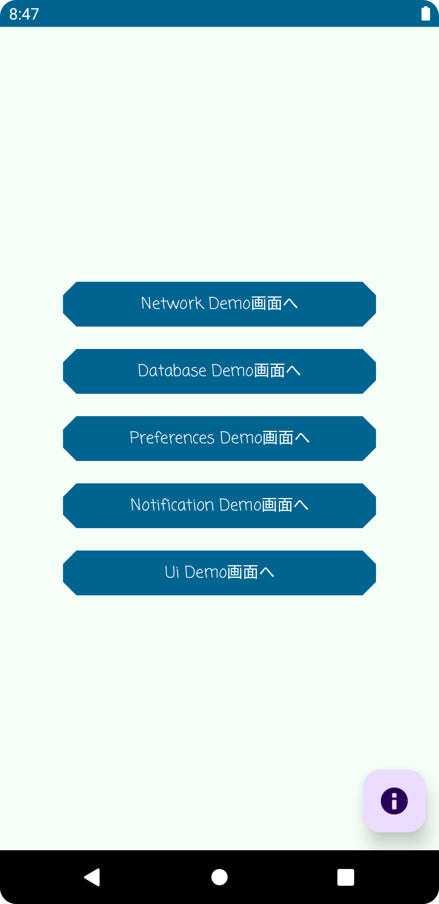
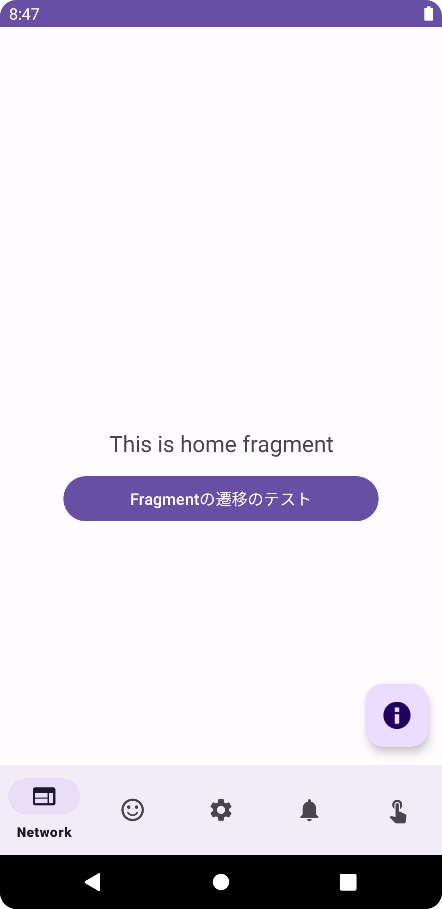
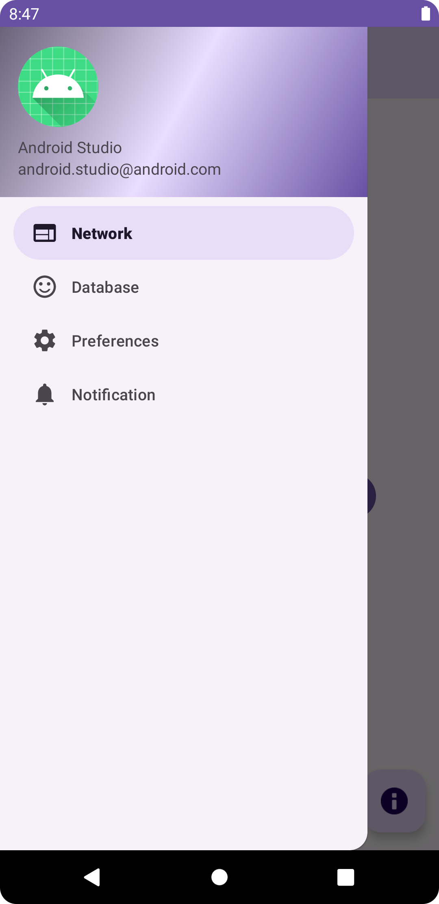

# Overview

Kotlin未経験で、Android Javaでアプリ開発したい人向けのテンプレートプロジェクト 
productFlavorsでテンプレートを切り替える仕組みにしています。 
使い方など、詳しいことは以下のWikiにまとめています。 
https://github.com/LeoAndo/AndroidBasicApp/wiki 

# capture: pixel3a API 29

| simple                                                 | bottmbar                                     | drawer                                    |
--------------------------------------------------------|----------------------------------------------|-------------------------------------------
|  |  |  |
