# Overview

Kotlin未経験で、Android Javaでアプリ開発したい人向けのテンプレートプロジェクト 
productFlavorsでテンプレートを切り替える仕組みにしています。 
使い方など、詳しいことは以下のWikiにまとめています。 
https://github.com/LeoAndo/AndroidBasicApp/wiki 

# capture: Light Theme

## pixel3a API 30
| simple                                          | bottmbar                                           | drawer                                          |
-------------------------------------------------|----------------------------------------------------|-------------------------------------------------
| 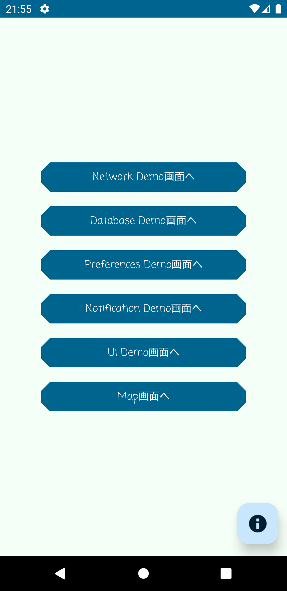 | 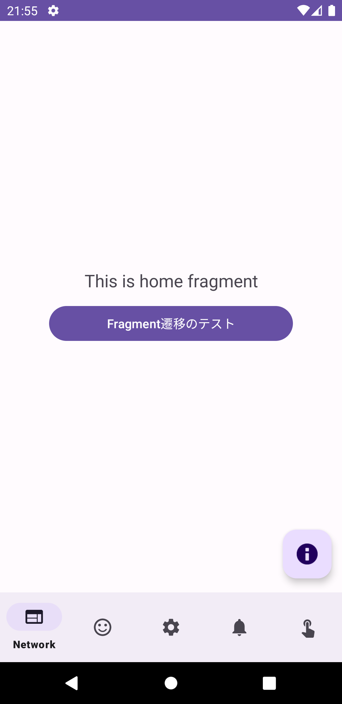 | 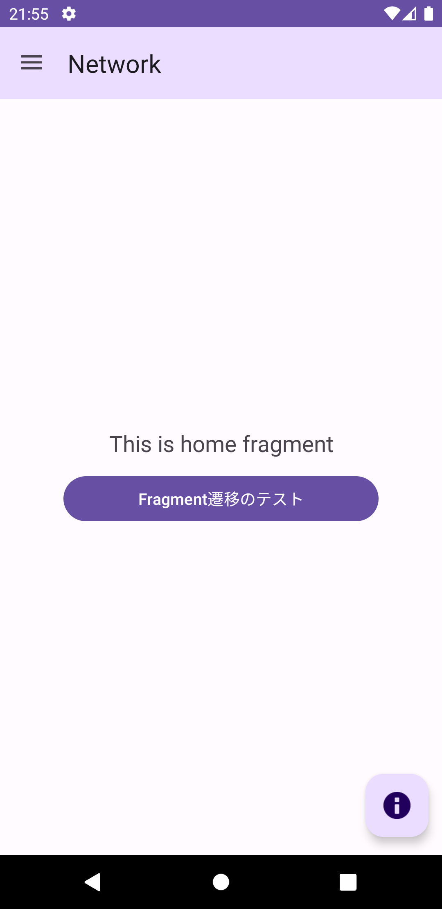 |

## pixel3a API 34
| simple                                          | bottmbar                                           | drawer                                          |
-------------------------------------------------|----------------------------------------------------|-------------------------------------------------
| 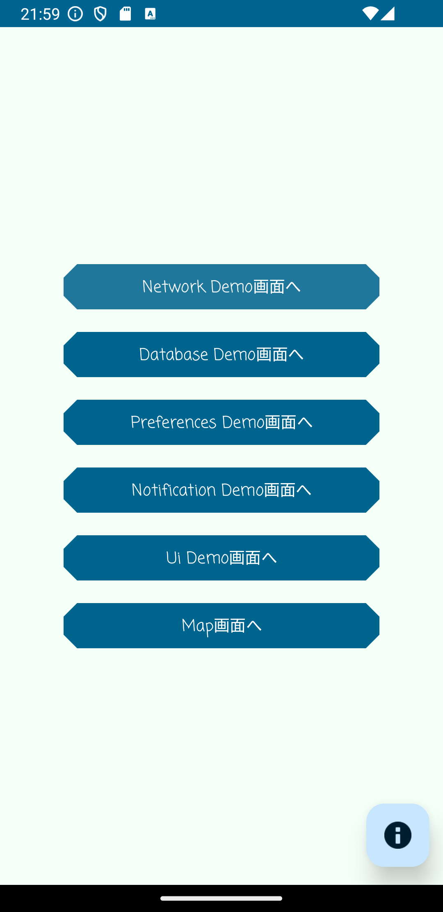 | 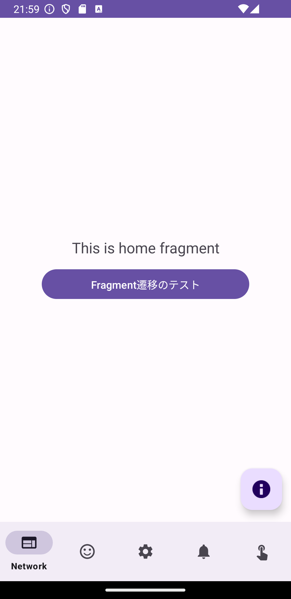 | 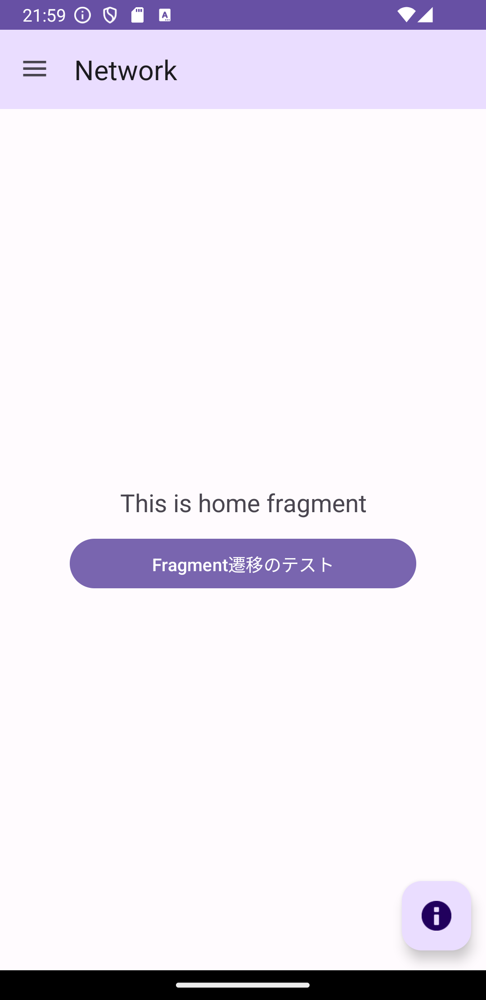 |

# capture: Dark Theme

## pixel3a API 30
| simple                                               | bottmbar                                                | drawer                                               |
------------------------------------------------------|---------------------------------------------------------|------------------------------------------------------
|  | 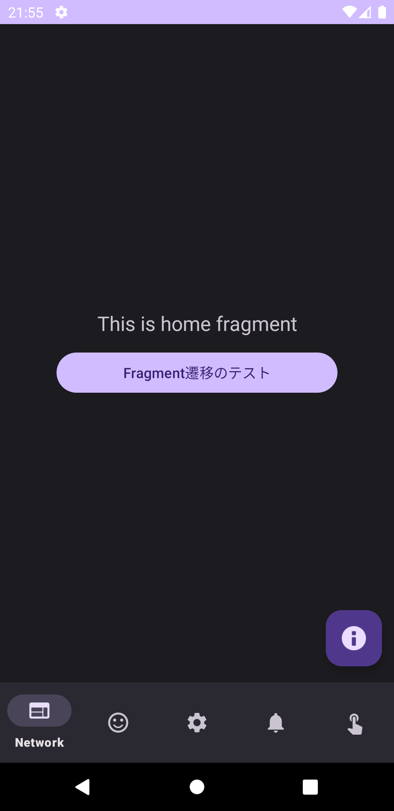 | 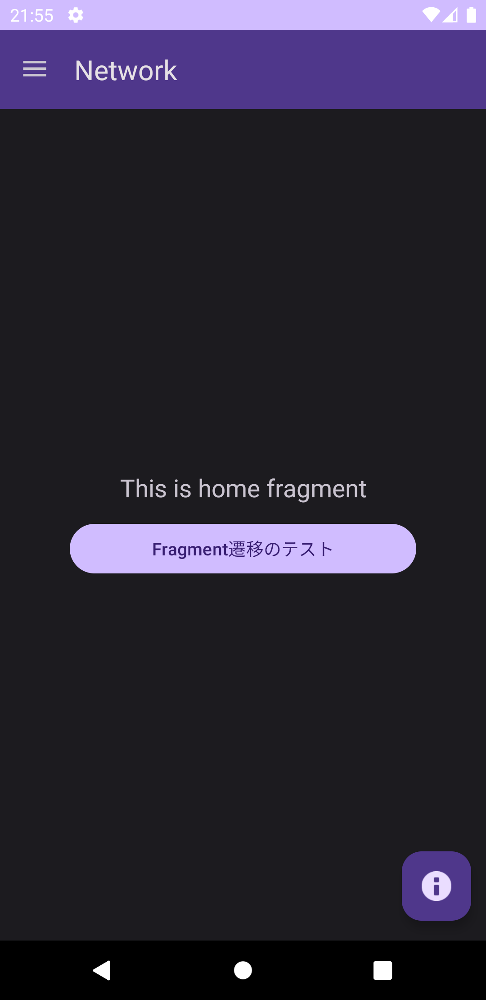 |

## pixel3a API 34
| simple                                               | bottmbar                                                | drawer                                               |
------------------------------------------------------|---------------------------------------------------------|------------------------------------------------------
| 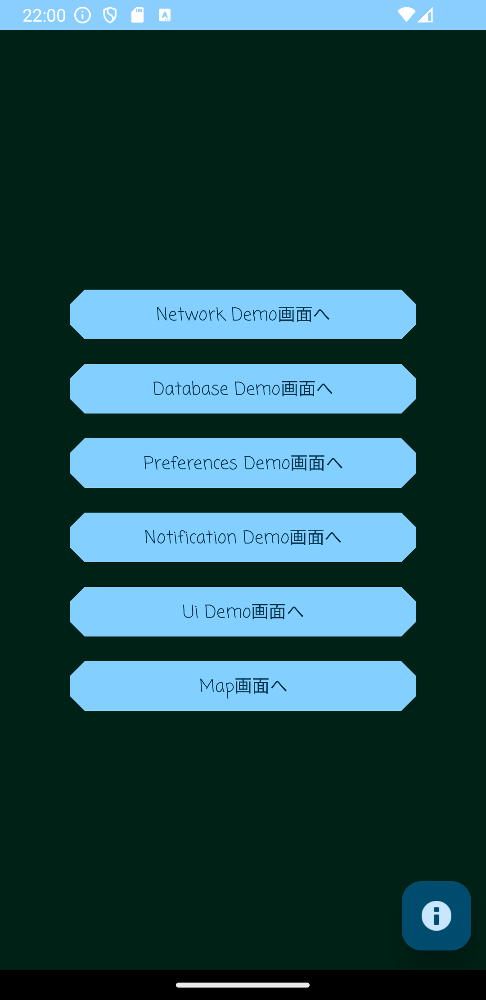 | 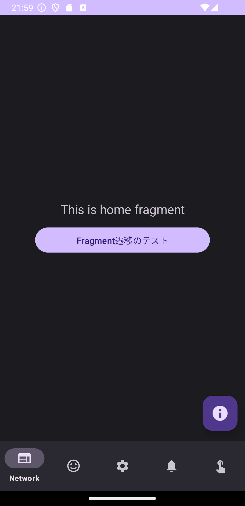 | 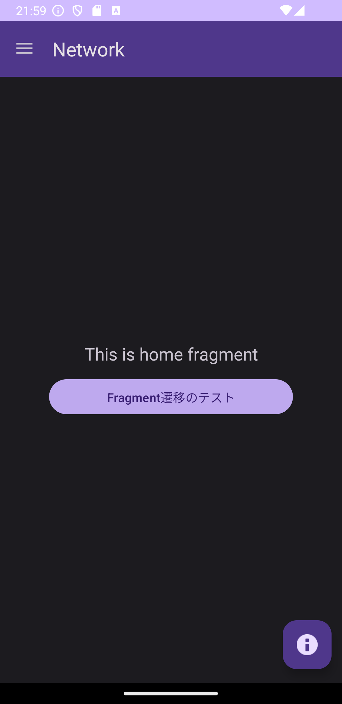 |
